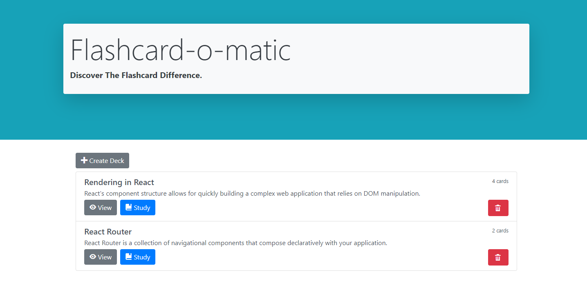

# About Thinkful-Flashcards
Thinkful Frontend Capstone Project - Flashcard-O-Matic
This application allows a user to create their very own deck of flashcards so that they can study effectively. 
A new deck can be created which will in turn allow for new cards to be created. 
Each card has a front side with a question and a back side that will provide the answer. 
## Project Goals
This project was designed to demonstrate the student's knowledge of core React concepts including:
* Managing State
* Passing props into components
* Adhering to single responsibility within components
* Dynamically rendering data
* Managing large projects with many files and moving parts

## Technology and Tools
The project utilizes the following:
* React library for state management and rendering - [ReactJS](https://reactjs.org/)
* Bootstrap 4.5.2 for styling - [Bootstrap 4.5](https://getbootstrap.com/docs/4.5/getting-started/introduction/)
* Open Iconic for button icons - [Open Iconic](https://useiconic.com/open)
* JSON Server for local preview - [JSON Server](https://www.npmjs.com/package/json-server)

## Application Preview

